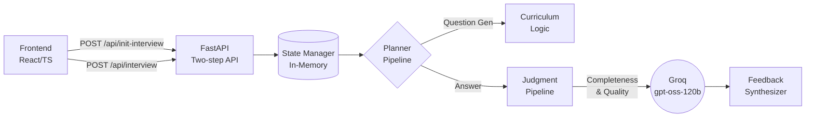

# AI Cohort · Adaptive Interview Agent
> **An intelligent, voice-capable technical interviewer driven by adaptive curriculum logic and honest feedback.**

## 🔗 Live Demos
- **Frontend:** [https://interview-agent-delta-roan.vercel.app/](https://interview-agent-delta-roan.vercel.app/)  
  *(**Note:** Voice mode requires Google Chrome or Chromium-based browsers for Web Speech API support. Text mode works anywhere!)*
- **Backend (API):** `https://interview-agent-sad6.onrender.com`

---

## ⚡ What Makes This Different?

Most "AI interviewers" are just basic chatbots asking a hardcoded list of questions in sequence, followed by a generic "good job!" at the end. This agent is built to replicate the rigorous, adaptive nature of a real technical interview:

- **Adaptive, Not Scripted:** Real decision logic (advance / follow-up / reframe / skip) is driven by a strict JSON judgment classifier evaluating every answer against curriculum objectives—not vibes.
- **Personalized from Real Signals:** Question generation is injected with the candidate's actual `data.py` learning signals (pass/fail rates, skip counts, recent attempts), ensuring the difficulty matches their specific track record.
- **Voice Mode with Silence Detection:** A fully hands-free speech-in/speech-out experience. It naturally detects if you pause or struggle (via 7-second silence tracking) and politely reprompts or offers to skip, seamlessly reusing the backend's core routing logic.
- **Honest, Unfabricated Feedback:** The synthesizer is strictly constrained. If a candidate gives zero substantive answers, the report yields zero fabricated praise. Strengths are completely omitted if they don't exist in the transcript.

---

## 🏗️ Architecture



---

## 🧠 The Adaptive Decision Logic

The core engineering of the agent lies in `planner.py`. When a candidate answers, the LLM classifies it across two dimensions (`completeness` and `quality`). The state machine then routes the conversation deterministically:

| Completeness | Quality | Action Taken |
| :--- | :--- | :--- |
| `full` | `strong` | **Advance Topic**: Perfect answer. Moves immediately to the next topic to save time. |
| `full`/`partial` | `shallow` | **Follow-Up**: Asks the candidate to expand on their answer or provide a concrete example. (Max 2 follow-ups per topic). |
| `partial` | `confused` | **Reframe**: Restates the question in a simpler or more specific way. |
| `missing` | `off_topic` | **Redirect**: First time: gently reminds them of the topic. Second time: **Force-Advances** the topic to prevent the interview from stalling. |

---

## 🛠️ Tech Stack

| Layer | Technologies |
| :--- | :--- |
| **Frontend** | React 19, TypeScript, Vite, Tailwind CSS, Web Speech API (TTS/STT) |
| **Backend** | FastAPI, Pydantic, SlowAPI (Rate Limiting) |
| **AI / LLM** | Groq (`openai/gpt-oss-120b`), Tenacity (Retries/Resilience) |
| **Deployment** | Vercel (Frontend), Render (Backend), Python 3.11.9 |

---

## 🚀 Setup & Local Development

### 1. Backend

1. Create a virtual environment and install dependencies:
   ```bash
   cd backend
   python -m venv venv
   source venv/bin/activate  # On Windows: venv\Scripts\activate
   pip install -r requirements.txt
   ```
2. Set up your `.env` file (copy `.env.example`):
   ```env
   GROQ_API_KEY=gsk_your_real_key_here
   RATE_LIMIT=20/minute
   ALLOW_ORIGINS=http://localhost:5173
   ```
3. **Start the API (Crucial Constraint):**
   ```bash
   python -m uvicorn main:app --host 127.0.0.1 --port 8000 --workers 1
   ```
   > ⚠️ **Why `--workers 1`?** Session states are stored entirely in an in-memory dictionary. If multiple workers are used, Turn 1 and Turn 2 will likely hit different OS processes, and the interview state will break silently.

### 2. Frontend

```bash
cd frontend
npm install
npm run dev
```
Navigate to `http://localhost:5173`. Ensure you are using Chrome if you intend to test Voice Mode.

### Frontend experience

The frontend is a focused interview workspace rather than a dashboard:

- **Landing:** Full-screen cinematic hero, MAESTER wordmark, and a single start action.
- **Setup:** Candidate name, target role, PDF resume upload, camera preview, mirror toggle, and a pre-permission dialog for camera and microphone access.
- **Interview:** Text or voice interaction, adaptive AI questions, tab-switching warning, and camera-in-picture preview.
- **Feedback:** Honest strengths, weak sections, and improvement areas generated from the completed transcript.

The frontend uses `VITE_API_BASE_URL` when provided and otherwise targets `http://127.0.0.1:8000`.

---

## 📡 API Contract

The application uses a two-step, stateful API. Session state is held in the backend process.

### 1. Initialize a session

The setup form uploads the resume and candidate details as multipart form data:

```http
POST /api/init-interview
Content-Type: multipart/form-data
```

Form fields: `resume` (PDF), `role`, and `name`.

**Response:**

```json
{ "sessionId": "abc-123" }
```

### 2. Request the first question

The frontend immediately sends an empty message so the backend creates the first transcript turn and returns the first question.

**Request:**
```json
{
  "sessionId": "abc-123",
  "message": ""
}
```
**Response:**
```json
{
  "reply": "Tell me about the most technically challenging project on your resume.",
  "done": false
}
```

### 3. Mid-turn (continuing the interview)

For subsequent turns, send the candidate's answer. The backend keeps the candidate, question plan, transcript, and judgments in memory for that `sessionId`.

**Request:**
```json
{
  "sessionId": "abc-123",
  "message": "I think embeddings are dense vector representations..."
}
```
**Response:**
```json
{
  "reply": "That's exactly right. Can you elaborate on how you'd store them?",
  "done": false
}
```

### 4. Final turn (feedback generation)
When the interview reaches its conclusion (after covering the set number of topics), the backend signals completion and synthesizes the full transcript into a structured feedback object.

**Request:**
```json
{
  "sessionId": "abc-123",
  "message": "I would use a vector database like Pinecone."
}
```
**Response:**
```json
{
  "reply": "Great. We've covered everything we needed to today! I'm preparing your feedback now...",
  "done": true,
  "feedback": {
    "summary": "Sarah demonstrated a strong foundational understanding of vector representations and storage.",
    "strong_sections": ["Clear explanation of dense vectors", "Familiarity with Pinecone"],
    "weak_sections": ["Did not mention indexing algorithms like HNSW"],
    "areas_to_improve": ["Review vector database indexing strategies for scaling"]
  }
}
```

---

## 🚧 Known Limitations & Future Work

Authenticity and engineering maturity mean acknowledging trade-offs:

1. **In-Memory Session State:** The `_sessions` dictionary in `main.py` is memory-bound to a single Python process. To scale horizontally (multiple workers or container orchestration), this needs to be migrated to Redis.
2. **Browser Support for Voice:** Voice mode strictly depends on the experimental `window.SpeechRecognition` API, which currently only has stable support in Chrome/Chromium browsers.
3. **Pydantic Compilation:** Deployments require a specific Python build environment (e.g., Python 3.11) with pre-compiled Rust wheels for `pydantic-core` to avoid exhausting CI/CD build resources during deployment.
4. **Media permissions:** Camera and microphone access must be granted by the browser before an interview can start. Voice mode requires a Chromium-based browser with Web Speech API support.

--- 

## 🤖 Built with Antigravity

This project was built iteratively using Google's **Antigravity** autonomous AI coding agent. 

Rather than hiding the AI-assisted process, the full provenance is available for review:
- 📖 [**PROMPTS.md**](PROMPTS.md): The original architecture instructions and directives detailing the exact iterative build process and decision making.
