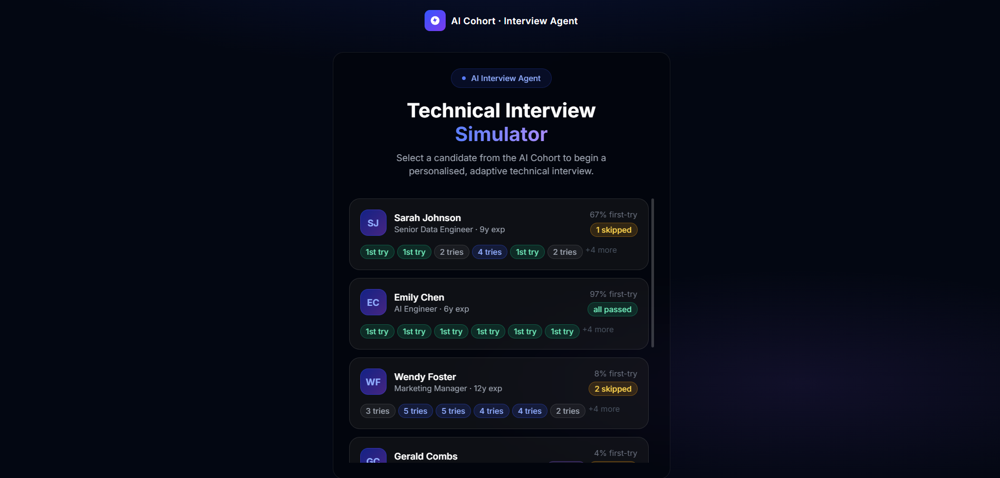

# AI Cohort · Interview Agent

An intelligent, autonomous technical interview agent built with React, FastAPI, and Groq. It conducts real-time technical interviews, dynamically generating questions based on the candidate's resume, day of the cohort, and previous answers. It gracefully handles off-topic responses, maintains conversational state, and ultimately provides a comprehensive, structured feedback report.

 *(Add your demo screenshot here)*

## ✨ Features

- **Dynamic Question Generation:** Uses Llama-3-70b via Groq to craft contextual, challenging technical questions tailored to the candidate's specific background.
- **Voice Mode (Hands-Free):** Complete hands-free experience! The agent speaks questions using Text-to-Speech (TTS) and actively listens to your answers using Speech-to-Text (STT) natively in the browser. 
- **Smart Silence Detection:** In Voice Mode, the agent recognizes when you pause or struggle, automatically prompting you ("I didn't quite catch that...") or allowing you to skip.
- **Robust Conversational Flow:** It can detect off-topic answers, redirect you back to the subject, or gracefully force-advance to the next topic if you're stuck.
- **Comprehensive Grading & Feedback:** At the end of the session, it synthesizes the entire transcript into structured feedback, detailing Strengths, Areas for Improvement, and Next Steps.

## 🚀 Tech Stack

### Frontend
- **React 18** (Vite)
- **TypeScript**
- **Tailwind CSS** (Glassmorphism design system)
- **Web Speech API** (TTS/STT Integration)

### Backend
- **FastAPI** (Python 3)
- **Groq API** (`llama3-70b-8192` for lightning-fast inference)
- **SlowAPI** (Rate Limiting)
- **Pydantic** (Strict structured outputs and validation)

## 🛠️ Getting Started

### Prerequisites
- Node.js (v18+)
- Python (3.10+)
- A [Groq API Key](https://console.groq.com/)

### 1. Backend Setup

```bash
cd backend
python -m venv venv

# Windows
venv\Scripts\activate
# Mac/Linux
source venv/bin/activate

pip install -r requirements.txt
```

Create a `.env` file in the `backend` directory:
```env
GROQ_API_KEY=your_api_key_here
```

Start the API server (must run with 1 worker to preserve in-memory session state):
```bash
python -m uvicorn main:app --host 127.0.0.1 --port 8000 --workers 1
```

### 2. Frontend Setup

```bash
cd frontend
npm install
npm run dev
```

Navigate to `http://localhost:5173` in your browser (preferably Chrome for Voice Mode support).

## 🔒 Security & Reliability
- Strict Rate Limiting on the `/api/interview` endpoint.
- Programmatic Fallback Handlers prevent infinite loops if the LLM fails to synthesize feedback.
- Pydantic models actively block malformed or oversized requests.

## 📝 License
MIT License.
